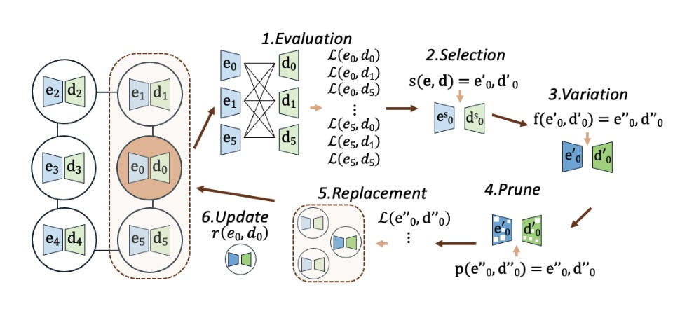

# Guiding Evolutionary AutoEncoder Training with Activation-Based Pruning Operators
by Steven Jorgensen, Erik Hemberg, Jamal TouTouh, and Una-May O'Reilly

This repository is the official implementation of the work conducted in [Guiding Evolutionary AutoEncoder Training with Activation-Based Pruning Operators](https://doi.org/10.1145/3712256.3726449). 

## About
Deep learning models often require training at a greater capacity (i.e., with more parameters) than the dimensionality of their inputs, which leads to high computational costs during training and inference. Parameter pruning removes redundant parameters while maintaining or improving performance. This study explores a coevolutionary approach to autoencoder training and pruning, demonstrating that when scheduled correctly, it can outperform traditional methods and enable pruning during training rather than post-training.



## Abstract
This study explores a novel approach to neural network pruning using evolutionary computation, focusing on simultaneously pruning the encoder and decoder of an autoencoder. We introduce two new mutation operators that use layer activations to guide weight pruning. Our findings reveal that one of these activation-informed operators outperforms random pruning, resulting in more efficient autoencoders with comparable performance to canonically trained models. Prior work has established that autoencoder training is effective and scalable with a spatial coevolutionary algorithm that cooperatively coevolves a population of encoders with a population of decoders, rather than one autoencoder. We evaluate how the same activity-guided mutation operators transfer to this context. We find that random pruning is better than guided pruning, in the coevolutionary setting. This suggests activation-based guidance proves more effective in low-dimensional pruning environments, where constrained sample spaces can lead to deviations from true uniformity in randomization. Conversely, population-driven strategies enhance robustness by expanding the total pruning dimensionality, achieving statistically uniform randomness that better preserves system dynamics. We experiment with pruning according to different schedules and present best combinations of operator and schedule for the canonical and coevolving populations cases.

## Result Plots

Please see the generated figures in [paper_plots.ipynb](https://github.com/ALFA-group/lipizzaner-ae-prune/blob/main/paper_plots.ipynb) for result plots.

## Setup

**Requirements**
* Python 3.12 or later
* Pip
* Anaconda (recommended)

### Installation

Create the Conda environment:
```
conda create --name lipi_ae python=3.12
```
Activate the environment:
```
conda activate lipi_ae
```
Install dependencies:
```
pip install -r requirements.txt
```

## Getting Started

### Generating the Dataset
To generate the Binary Clustering Problem dataset used in the paper:
```
PYTHONPATH=src python src/aes_lipi/utilities/gecco_25_experiments.py --create_data True
```

To generate Binary Clustering problems with custom settings:
```
PYTHONPATH=src python src/aes_lipi/datasets/data_loader.py --n_dim 1000 --n_clusters 10
```

### Running Experiments

The general way to run an individual experiment is to specify the preset configuration (RQ_NAME) you wish to run:

```
PYTHONPATH=src python src/aes_lipi/utilities/gecco_25_experiments.py --rq <RQ_NAME>
```

Each preset RQ_NAME option and the associated configuration can be found in the `src/aes_lipi/utilities/gecco_25_experiments.py` file in the `rq_sensitivities` dictionary. Some of the important configuration settings include:

* `"epochs"` - Number of generations to run the population for
* `"learning_rate"` - Optimizer learning rate for the AutoEncoders
* `"trials"` - Number of experiment replicates
* `"radius"` - Ring neighborhood radius for populations
* `"lexi_threshold"` - Pruning threshold for CONJUNCTIVE pruning method
* `"cell_evaluation"` - Type of AE Trainings to be run. Options are [ann_canonical, lipi_simple]
* `"population_size"` - Number of Encoder, Decoder pairs in the population
* `"environment"` - Model architechture to use. Options are [AutoencoderBinaryClustering, AutoencoderBinaryClustering_Small]
* `"dataset_name"` - Name of Binary Clustering dataset to use for training and evaluation
* `"prune_method"` - Type of pruning to be used during evolution. The options are [random, lexicase, activation], where lexicase is the CONJUNCTIVE method from the paper and activation is the VARIANCE method.
* `"prune_schedule"` - Type of pruning schedule to use during evolution. The options are [fixed, increase, population, decrease, exponential, final_n]
* `"prune_probability"` - The probability that pruning occurs for an individual during the pruning phase of the algorithm
* `"prune_amount"` - The percent of nodes to prune when pruning occurs. This has no effect when using the CONJUNCTIVE pruning method.

To run **all** of the provided preset configurations:
```
PYTHONPATH=src python src/aes_lipi/utilities/gecco_25_experiments.py --rq all_rqs --all_rqs True
```
Note: Running all configurations will take significant time; running them individually is recommended.

## Reference
```
@inproceedings{jorgensen2025ae,
  title={Guiding Evolutionary AutoEncoder Training with Activation-Based Pruning Operators},
  author={Jorgensen, Steven Hemberg, Erik Toutouh, Jamal and O'Reilly, Una-May},
  booktitle={Proceedings of the Genetic and Evolutionary Computation Conference},
  year={2025}
}
```